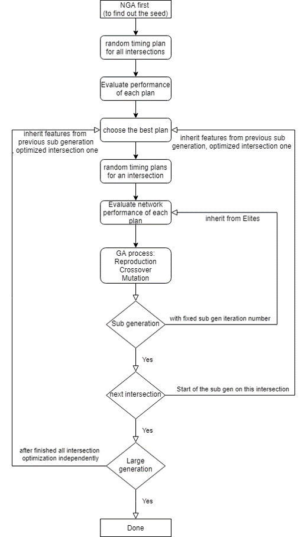

# Genetic algorithms c++
Genetic algorithms (GA) was written in c++. It can be used as a library for optimizing the traffic signal timing plan in both python and c++ platform through multithreading for high performance core computation.
The genetic algorithm is a type of evolutionary algorithms, and within this project it was derived into NGA and SGA variation respectively.

## Input parameters of general GA
 

## Flow chart of NGA
 

## Flow chart of NGA
 

## General computational process of GA
GA consisted of 13 steps, and it keeps iterating until the generation met up the best performance of the eval value. Too see more detialed, could have checked up <<Genetic algorithms c++ explanation.pdf>> in details
1. Randomly generate timing plan 
2. Evaluating performance
3. Sorting populations
4. Keep elite 
5. fitness ratio calculation
6. Reproduction of the intermediate parents 
7. Selections of single run crossover
8. Crossover
9. mutation
10. Decoding (translation binary to decimal integer, decimal to binary integer)
11. Checking crossphase requirement
12. Checking history for overlapping population
13. Keep on prepare for next generation

## Reference
[Dynamic network traffic control](https://repository.hkust.edu.hk/ir/Record/1783.1-24015)
[Control Strategies for Oversaturated Traffic](https://ascelibrary.org/doi/10.1061/%28ASCE%290733-947X%282004%29130%3A4%28466%29)
[Advances in Genetic Algorithm Optimization of Traffic Signals](https://ascelibrary.org/doi/10.1061/%28ASCE%290733-947X%282009%29135%3A4%28160%29)